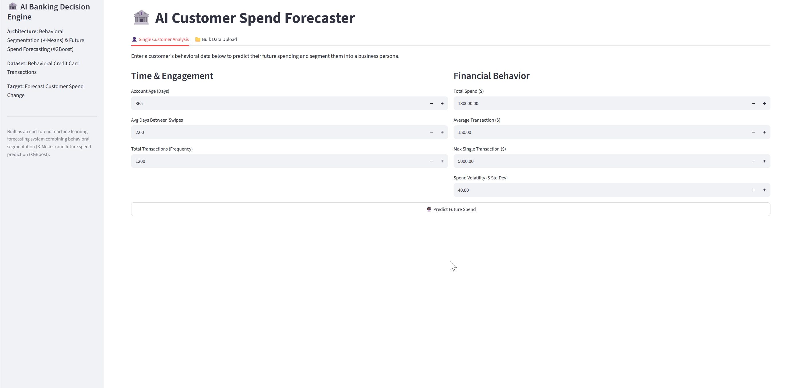
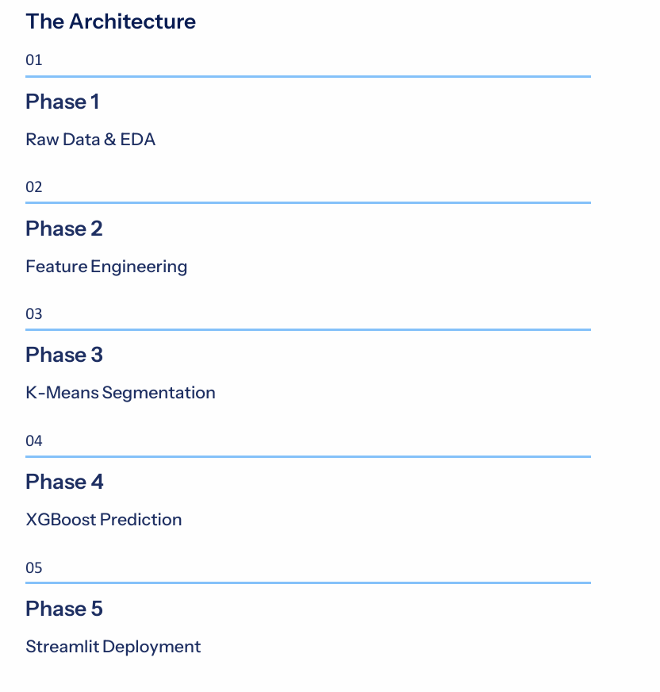
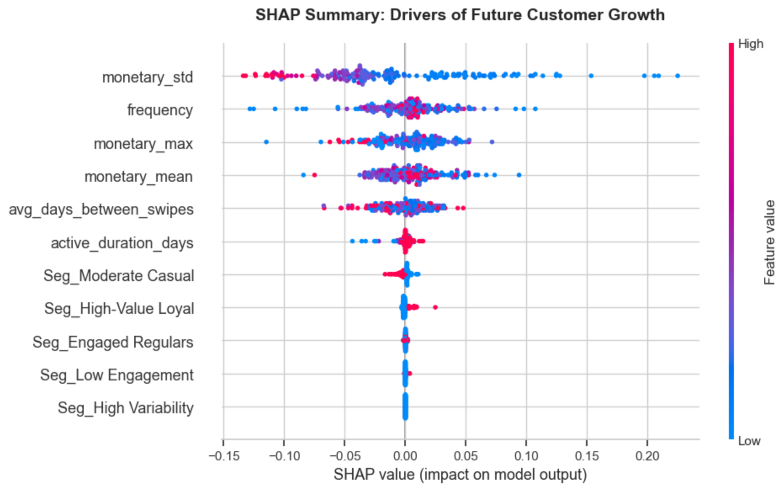
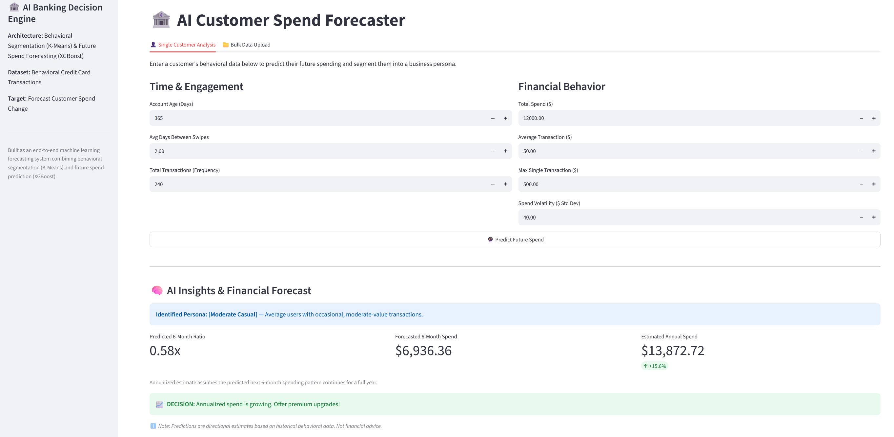

# 🏦 AI Customer Spend Forecaster & Behavioral Segmentation

[](https://www.python.org/)
[](https://xgboost.readthedocs.io/)
[](https://scikit-learn.org/)
[](https://streamlit.io/)
[](https://shap.readthedocs.io/)
[](https://opensource.org/licenses/MIT)

An end-to-end Machine Learning pipeline that translates raw credit card transactions into actionable behavioral personas and predicts future spending trajectories to prescribe automated banking decisions.

**[🚀 Live Streamlit Dashboard](https://customer-spend-forecaster-ghsckvjkowpfxghf2zhxfm.streamlit.app/)**

---

## 🚀 Quick Demo



---

## 💼 Business Impact
Financial institutions sit on terabytes of transactional data but typically rely on **reactive retention**—only knowing a customer is dissatisfied after they close their account. This system shifts the paradigm from reactive to **proactive**. 

Banks and marketing teams can use this AI engine to:
*   **Identify high-value customers** hidden within raw transaction logs.
*   **Forecast future customer spending** using a predicted 6-month spending ratio and estimated future spend.
*   **Trigger proactive retention campaigns** before a customer officially churns.
*   **Segment customers** for highly personalized, cost-efficient marketing.
*   **Improve revenue forecasting** by moving beyond simple historical averages.

---

## 🏗️ System Architecture



This project demonstrates an end-to-end Data Science and Machine Learning lifecycle:

### 1. Data Engineering & Feature Engineering
*   **Temporal Feature/Target Design:** To simulate a real-world forecasting environment, features were derived exclusively from 2019 transaction history, while the target represents customer spending during the Jan-Jun 2020 target period. For predictive evaluation, customers were split into an 80/20 training/testing hold-out, with 5-fold cross-validation performed on the training set.
*   **Behavioral Feature Engineering:** Converted 1.29 million raw transaction rows into 908 customer profiles using frequency, monetary and timing metrics (e.g., *Spend Volatility*, *Average Transaction Gap*). Demographic features (age, gender) were deliberately excluded so predictions use behavior only.

### 2. Behavioral Segmentation (K-Means)
Using **K-Means Clustering** (k=5 chosen for interpretability; silhouette peaked at k=8; PCA used for 2D visualization), the customer base was segmented into 5 actionable business personas.

K-Means was fitted on all 908 customers before the train/test split (unsupervised, target not used); the persona flags are model inputs.

| Persona | Description |
| :--- | :--- |
| 💎 **High-Value Loyal** | Elite spenders with high loyalty and massive transaction volumes. |
| 📈 **Engaged Regulars** | Highly frequent, stable, and reliable daily utility users. |
| 🎢 **High Variability** | Unpredictable spenders with erratic, massive transaction spikes. |
| 📊 **Moderate Casual** | Average baseline users with standard financial behavior. |
| ⚠️ **Low Engagement** | Infrequent users posing a high churn risk. |

---

## 🧠 Predictive Modeling (XGBoost)

Trained an **XGBoost Regression** model to predict future spending momentum. Instead of predicting absolute future dollars (which artificially biases the model toward wealthy users), the model targets the **Logarithmic Growth Ratio**. Predicting a ratio instead of absolute dollars puts customers with very different spend levels on the same scale.

| Model | CV MAE (Log Space) | Test MAE (Growth Ratio Error) | Test R² |
| :--- | :---: | :---: | :---: |
| Linear Regression | 0.1154 | 0.0460 | 0.0935 |
| Random Forest | **0.1084** | **0.0453** | 0.1228 |
| **XGBoost** | 0.1129 | 0.0454 | **0.1425** |

*Note: The target shows relatively limited variance, resulting in modest R² values. The models nevertheless outperform a naive mean predictor on the held-out test set. Random Forest achieves the lowest Test MAE (0.0453), while XGBoost achieves the highest Test R² (0.1425).*

### Naive Baseline

A naive mean predictor was used as a benchmark. On the held-out test set, the mean predictor achieved a Test MAE of **0.04768**, compared with **0.0453** for Random Forest and **0.0454** for XGBoost. Its Test R² was approximately **0.000**, establishing that the trained models provide predictive signal beyond simply predicting the average growth ratio.

---

## 🔍 Explainable AI (SHAP)

Model interpretability is important in financial decision support systems. **SHAP (SHapley Additive exPlanations)** was integrated to explain how individual features contribute to model predictions and to improve model transparency.



**Key Insights:** *Spend Volatility (Standard Deviation)* and *Transaction Frequency* emerged as important contributors to the model's predictions. These findings can help identify customer groups whose spending behavior may warrant closer monitoring.

---

## 💻 Deployment & The Decision Engine



The pipeline is deployed via a **Streamlit** web application, bridging the gap between machine learning math and business intelligence.

*   **Annualized Run-Rate Optimization:** Because the model predicts a 6-month window but historical data covers 12 months, the deployment layer mathematically annualizes the forecast. This allows the system to generate intuitive business thresholds around a 1.0 growth ratio:
    *   🚨 **< 0.95 (Decline):** Triggers immediate Retention Marketing.
    *   📈 **> 1.05 (Growth):** Triggers Premium Upgrade Offers.
    *   ⚖️ **Stable:** Recommends continued engagement monitoring.
*   **Scalable Interface:** Features a dual-tab architecture supporting single-customer analysis and CSV upload workflows, with batch prediction functionality planned as a future enhancement.

---

## 🛠️ Technology Stack

*   **Core:** Python, Pandas, NumPy
*   **Machine Learning:** Scikit-Learn (K-Means, PCA, Linear Regression, Random Forest), XGBoost
*   **Explainable AI:** SHAP
*   **Data Visualization:** Matplotlib, Seaborn
*   **Deployment & UI:** Streamlit, Joblib

---

## ⚠️ Limitations

* **Modest predictive performance:** Test R² is approximately 0.14 on the held-out test set.
* **Evaluation split:** Predictive evaluation uses a random 80/20 customer-level hold-out.
* **Persona preprocessing:** K-Means personas were fitted before the predictive train/test split; this is a preprocessing limitation, although the clustering is unsupervised and does not use the future target.
* **Dataset:** The project uses a simulated dataset.
* **Bulk prediction:** The Bulk CSV tab currently previews uploaded data; batch prediction is planned as a future enhancement.

## 📂 Repository Structure

```text
Customer-Spend-Forecaster/
├── app.py                  # Main Streamlit web application & UI layer
├── requirements.txt        # Python dependencies for deployment
├── README.md               # Project documentation
├── assets/                 # Architecture diagrams, SHAP plots, and UI screenshots
│   ├── dashboard.png
│   ├── shap_plot.png
│   ├── architecture.png
│   └── demo.gif
├── models/                 # Serialized .joblib files (XGBoost, K-Means, Scaler)
├── notebooks/              # Jupyter notebooks for EDA and Model Training
└── data/                   # Processed datasets (raw data ignored via .gitignore)
```

## 💻 How to Run This App Locally
If you want to run this project on your own computer, follow these steps:

### 1. Clone the repository:
```bash
git clone https://github.com/Murthaja-ai/Customer-Spend-Forecaster.git

cd Customer-Spend-Forecaster
```

### 2. Create and activate a virtual environment:

```bash
python -m venv venv

venv\Scripts\activate     # Windows 
source venv/bin/activate  # Mac/Linux 
```

### 3. Install the required libraries:
```bash
pip install -r requirements.txt
```

### 4. Launch the Streamlit web application:
```bash
streamlit run app.py
```

---

## 👨‍💻 Author

**Murthaja Afham**  
*Data Scientist • Machine Learning Engineer • AI Developer*

[](https://github.com/Murthaja-ai)
[](https://www.linkedin.com/in/murthaja-afham/)


